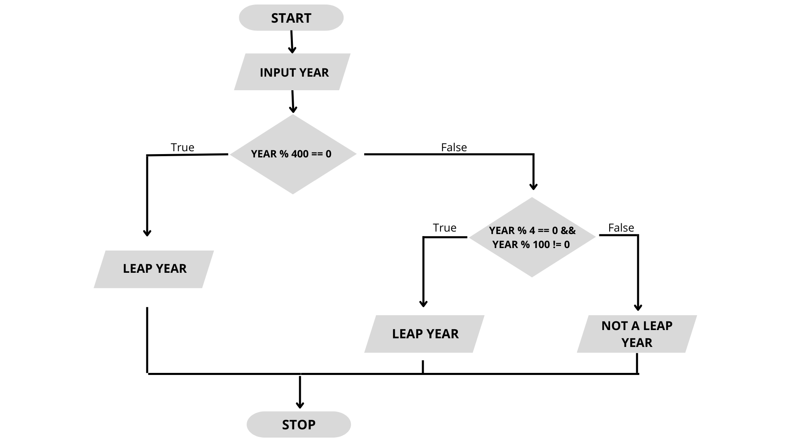

# Unidad 1 - Práctica JavaScript

# 1. Uso de Consola

## console.log

```js
console.log("Hola mundo");
`````

## console.warn

```js
console.warn("Advertencia");
```

## console.error

```js
console.error("Ocurrió un error");
```

## console.clear

```js
console.clear();
```

---

# 2. Variables y Datos

```js
let nombre = "Anderson";
let edad = 30;
const precio = 1500;

console.log(nombre);
console.log(edad);
console.log(precio);
```

## Modificar variable

```js
edad = edad + 1;

console.log(edad);
```

---

# 3. Arrays

```js
const series = ["Dark", "Breaking Bad", "Mr Robot"];

console.log(series);
```

## Agregar elemento

```js
series.push("The Office");

console.log(series);
```

---

# 4. let y const

## let

```js
let ciudad = "Buenos Aires";

ciudad = "Córdoba";

console.log(ciudad);
```

## const

```js
const pais = "Argentina";

// Error
// pais = "Chile";
```

---

# 5. Mutabilidad

```js
const numeros = [1, 2, 3];

numeros[0] = 100;

console.log(numeros);
```

## Explicación

Aunque `const` no permite reasignar la variable, sí permite modificar el contenido interno del array.

---

# 6. Función Tradicional

```js
function sumar(a, b) {
    return a + b;
}

console.log(sumar(2, 3));
```

---

# 7. Arrow Function

```js
const sumar = (a, b) => {
    return a + b;
};

console.log(sumar(5, 10));
```

## Return implícito

```js
const multiplicar = (a, b) => a * b;

console.log(multiplicar(2, 4));
```

---

# 8. Scope

## Scope local

```js
function ejemplo() {
    const mensaje = "Hola";

    console.log(mensaje);
}

ejemplo();

// Error
// console.log(mensaje);
```

## Scope global

```js
const saludo = "Bienvenidos";

function mostrarSaludo() {
    console.log(saludo);
}

mostrarSaludo();
```

---

# 9. Template Strings

```js
const nombre = "Anderson";
const edad = 30;

console.log(`Mi nombre es ${nombre} y tengo ${edad} años`);
```

---

# 10. Función mostrarLista

```js
function mostrarLista(lista) {

    if (lista.length === 0) {
        return "Lista vacía";
    }

    for (const elemento of lista) {
        console.log(elemento);
    }

    return `La lista tiene ${lista.length} elementos`;
}

console.log(mostrarLista([1, 2, 3]));
console.log(mostrarLista([]));
```

---

# 11. Closures

```js
function contador() {

    let cuenta = 0;

    return function () {
        cuenta++;
        return cuenta;
    };
}

const incrementar = contador();

console.log(incrementar());
console.log(incrementar());
console.log(incrementar());
```

---

# 12. Clases

## Clase Persona

```js
class Persona {

    static especie = "Humano";

    constructor(nombre) {
        this.nombre = nombre;
    }

    saludar() {
        console.log(`Hola, soy ${this.nombre}`);
    }
}

const persona1 = new Persona("Anderson");
const persona2 = new Persona("Juan");

persona1.saludar();
persona2.saludar();

console.log(Persona.especie);
```

---

# 13. Clase Contador

```js
class Contador {

    static cuentaGlobal = 0;

    constructor(responsable) {
        this.responsable = responsable;
        this.cuentaIndividual = 0;
    }

    getResponsable() {
        return this.responsable;
    }

    contar() {
        this.cuentaIndividual++;
        Contador.cuentaGlobal++;
    }

    getCuentaIndividual() {
        return this.cuentaIndividual;
    }

    getCuentaGlobal() {
        return Contador.cuentaGlobal;
    }
}

const contador1 = new Contador("Anderson");
const contador2 = new Contador("Juan");

contador1.contar();
contador1.contar();

contador2.contar();

console.log(contador1.getCuentaIndividual());
console.log(contador2.getCuentaIndividual());

console.log(contador1.getCuentaGlobal());
```

---

# 14. Ejecución con Node.js

## Ejecutar archivo JavaScript

```bash
node app.js
```

## Inicializar proyecto

```bash
npm init -y
```

---

# 15. Conceptos Practicados

* Uso de consola.
* Variables.
* Arrays.
* let y const.
* Mutabilidad.
* Funciones tradicionales.
* Arrow functions.
* Scope.
* Template strings.
* Closures.
* Clases.
* Métodos estáticos.
* Node.js.

## Ejercicio de Logica


